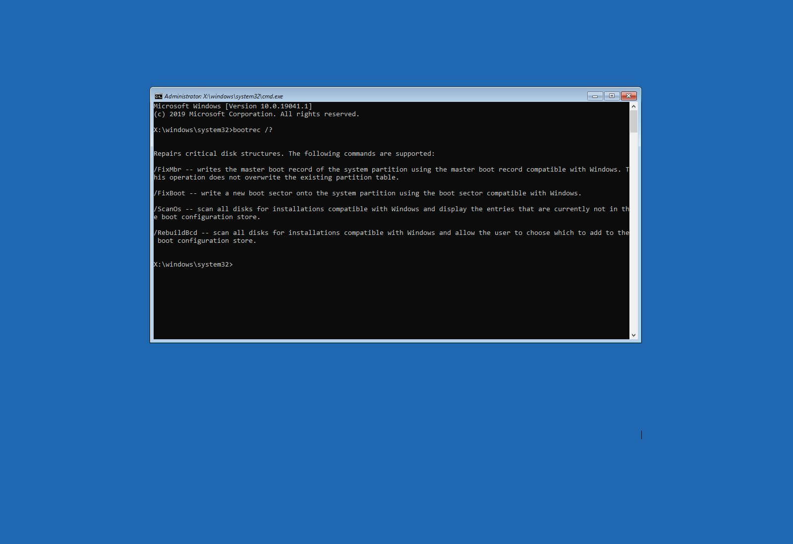

Ticket #1 - Main NVME ssd not being recoginzed as a bootdrive in BIOS.

Issue: Added a 2nd NVME ssd into my system in the secondary slot that was used in a previous build. When booting up the sysytem reverts to the 2nd drive rather than the main drive. The main drive was nowhere to be found no matter what i did. 

Date: Sunday, January 4th 6pm. 

Steps tried: 1st - Booting into the bios to load the correct drive from there. 2nd - Deleting the other drive as a boot drive to force windows to recoginze the main drive as the only boot drive. 3rd - Rebuild the master boot record from the beginning of a new windows installation. 

Resolution: Rebuilding the MBR (Master Boot Record) from a new windows installation screen. I was afraid that i would have to do a clean windows install but i saved all my custom built scrtipts for my design workflow and a saved myself some time from having to reinstall all my programs. 

Screenshot: This isnt my PC since i did not get any screenshots during the whole process but this serves as proof to what i was doing.

