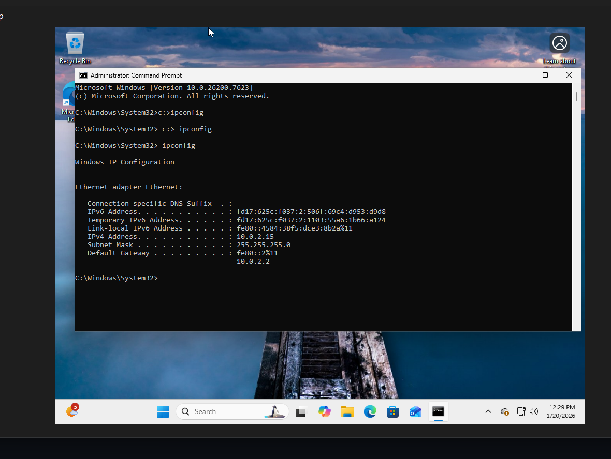

---
"Ticket #3 - No Internet Access (DNS Resolution Failure)"
date: "2026-01-22"
priority: "High"
status: "Resolved"
time-spent: "12 minutes"
---

# 🎫 TICKET #3: "No Internet Access"

## **USER REPORT**
**Issue:** "My laptop shows WiFi connected but no internet. Can't browse or use cloud apps."
**Symptoms:** WiFi icon shows connected, but websites won't load
**Environment:** Windows 11 VM (VirtualBox), corporate guest WiFi

## **DIAGNOSTIC STEPS**

### **Step 1: Verify Physical Connection**
**Result:** IP assigned ✓ | Gateway present ✓

### **Step 2: Test IP Connectivity**

